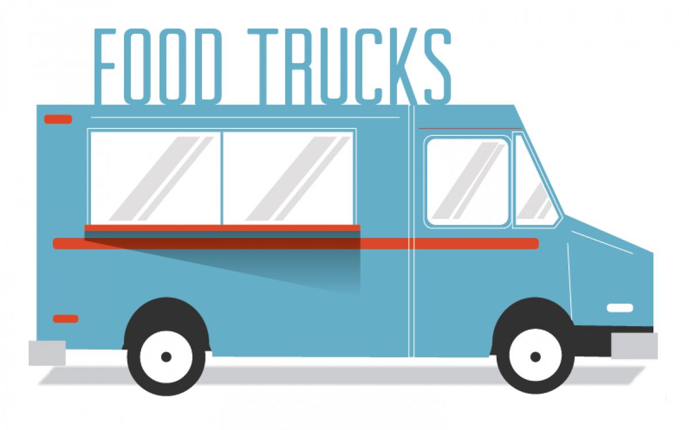

Recently at dinner, my 8 y.o. daughter asked one of the hardest questions I've had to answer - "**Daddy, What's Kubernetes?**"
##### Dinnertime
Now, before you start sending my daughter LinkedIn requests and job offers, the question was prompted by a routine dinnertime conversation and - as I was describing my day - the keyword, **Kubernetes**, came up. I was proud that she was engaged, and genuinely curious, but I quickly realized the difficulty in answering this seemingly simple question. In truth, the subject of what I do in general and Kubernetes, specifically, had come up before - but each explanation attempt had failed miserably. So, this time I decided to try a different approach - by starting with "Why".

I will get my explanation of Kubernetes in a bit - but for now, just trust me, Kubernetes is one of the hottest technologies in the industry at the moment and you should read on to learn more about the technology at the forefront of the Cloud Native movement. If, however, you are looking for a Kubernetes "how to" you probably aren't going to learn much in this article :).

##### Why is Kubernetes hard to explain?
I have always promoted the principle that it is easy to solve a complex problem with a complex solution but very hard to solve a complex problem simply. The ability to communicate a complex idea in a narrative that broad audiences can understand is hard, especially when discussing a complex technology. I am still working to develop such a skill...

*So, why is Kubernetes hard to explain?*
 The primary reason, I think, is that understanding Kubernetes requires *a posteriori* knowledge usually only acquired through experience.

To explain Kubernetes, effectively, requires understanding a lot foundational technology concepts - and, perhaps more importantly, to explain the problems these technologies are solving. Every thread you pull when describing Kubernetes has the potential to unravel the whole thing and create as many questions as answers. For those who have been in the industry awhile, the concepts come fast because of prior experience - both the successes and many more *failures*. But, for people who are *consumers* of technology - the concepts that Kubernetes is built upon are simply foreign.

##### What's Kubernetes?
But back to my 8 y.o. daughter and her important question. 

My first thought was to answer her question directly - "Kubernetes is a **container orchestration platform** that simplifies the ability for people to manage container based applications at scale." But, of course, that would not have gone over well with an 8 y.o. (or probably most people). While the above answer is accurate, to make sense of it you would need experience with containers, scale challenges in building applications, and even the definition of an application.

##### The Food Truck
Faced with these challenges, I did what all dads do when questions gets complex - I ~~changed the subject~~ came up with an analogy. Food Trucks 

>**Note:** It must be said, the wonderful [Childrens Illustrated Guide to Kubernetes](https://www.cncf.io/the-childrens-illustrated-guide-to-kubernetes/) is a well-loved marketing resource for explaining Kubernetes with compelling visualizations. 

The great thing about food trucks is that they are essentially small, specialized restaurants on wheels that are fairly inexpensive to operate. They usually offer fast service due to their limited menu - purpose-built to produce a small number of menu items and do them really well. Being mobile, they can also move to wherever hungry people are located. But, during the lunch rush even a food truck can get backed up with a line as each person in line has to wait for each previous order to be filled before they can get their food.

For example, if there is a line of 10 people and it takes 1 minute to prepare the order - the person in the back of the line must wait 10 minutes for their food. If the line grows to 100, that's 1 hour and 40 minute wait. Very few people would wait in *that* line, resulting in lost revenue due the limited capacity of this single food truck. 

##### Solution(s)

This is a good problem to have - clearly as the owner we'd be very happy to have more customers than capacity but how can we serve more customers (and make more money)?

What we need is a solution that is:

  + Scalable
  + Portable
  + Cost Efficient
  + Manageable

__Optimize__. The first step would be to optimize operations - increasing the number of people prepping, cooking, taking orders and assembling the food or increasing the cooking capacity of the equipment. However, at some point, the food truck is likely to be as efficient as possible and will have a limit to the number of customers it can serve per minute/hour/day. Incremental improvements are important, but if we need to handle 100X more customers, it is likely that we must come up with other options to increase **scale**.

__Scale Up - A Restaurant__. Building a freestanding restaurant would certainly increase the capacity for cooking and handling customer orders resulting in more customers served per minute/hour/day. However, building a restaurant is quite a bit more complex and costly to operate and it is definitely *not* **portable**. What if the long food truck lines are just temporary - a momentary fad or a need quickly satiated by competitors? Scaling up (aka vertically) - bigger building, better equipment, and more space is a good solution. However, is it the best solution? Scaling up in this manner can be risky and the costs to increase capacity cannot be recouped once spent if demand changes. 

__Scale Out - More Food Truck__. Another option is to simply duplicate the existing success by adding additional food trucks! Customers love the product and the service experience so let's give them more of what they want. Assuming fixed cost for an additional food truck and labor, it should be a pretty simple expansion of capacity to serve more customers per minute/hour/day. Scaling out (aka horizontally) - adding more capacity by duplicating food trucks can help satisfy the demand, but also is more **cost effective** and flexible. Food trucks are **portable** so can be moved to where demand exists, menuse can be modified as customer desires change, and are easier to dispose of when no longer needed.

__Manage - More, More Food Truck__. So now we have started to build a Food Truck empire. At a certain increase in scale, we start to encounter some challenges. What do you do with excess food trucks when demand slows? How do you ensure that you are locating the food trucks in the right locations where hungry people exist? With one food truck, it was obvious. But with dozens, hundreds, or thousands - these are really significant problems that only present themselves at scale. The solution? Create an entity to manage the food trucks to optimize revenue by making sure the right food trucks are in the right location at the right time to support demand but also to eliminate excess capacity.

##### Let's get back to Kubernetes

In our analogy, the "inside" of the food truck is the **application** - a specialized service that produces quality food as quickly as possible. The food truck itself is the **container** that allows the application to be portable and standardized so that it can be easily duplicated. As capacity demands increased, we added more food trucks but recognized that we needed an entity to manage and orchestrate the operations of all the food trucks - and that is precisely the role of **Kubernetes**.

While it is a bit of a stretch, building applications to support very large scale user demand (think Gmail, Twitter, etc.) faces similar problems to scaling a food truck business. It is relatively easy to build a single application that performs the desired functionality, but to support millions of concurrent users, we need to **scale** the application. And, just like with our analogy, scaling out versus scaling up in computing is more **cost efficient**. In recent years a new technology known as *containers* has been popularized that make it easy to package applications so that they are **portable**. Containers make it easier to break a large application into many small applications and also duplicate each application component to meet demand. However, adding hundreds or thousands of containers (with small applications inside) creates challenges that requires a **management** layer.

When demand exceeds capacity, **Kubernetes** can copy the container and its application (food truck and the service it provides) to support the demand and route traffic (customers) to available application capacity. As demand dips, **Kubernetes** can destroy the application to save resources. When an application is updated, a new container is created and **Kubernetes** ensures that the application is updated without impacting users. This is, essentially, what container orchestration is all about. There are many more details, but at its core what makes **Kubernetes** both popular and useful - it takes care of many of the technical and financial challenges that dynamic capacity creates in building and managing applications.

In computation, systems performance and scalability is largely bound by three factors:

- Compute
- Memory
- Input/Output (I/O)

To increase system performance, you must pay attention to each factor. Increasing **compute** can increase processing speed; additional **memory** allows more objects to be manipulated at one time; and faster **I/O** (ability to interact with the outside world and/or write data to disk) increases the pipeline of information to be processed. 

In modern computing, compute, memory and I/O are relatively inexpensive - and keep getting cheaper. That said, once you try to scale up (vertically) beyond a certain tier these factors - compute, memory, and I/O - become prohibitively expensive. And, similar to our food truck versus restaurant analogy - it is cheaper to expand horizontally using cheap commodity hardware versus bigger more expensive computation resources. In order to build massively large scale systems (e.g. Gmail, Lyft, etc.), in a cost effective manner it is better to scale horizontally (more copies of the applications) than vertically (buying bigger CPUs, memory chips or faster read/write capacity). 

Our physical world analogy can only take us so far and starts to break down in comparison to the digital world when we look closer. In the physical world, duplicating a food truck does have a cost and takes time. But in the digital world, creating a new application can be nearly instantaneous and is cost efficient. Destroying a food truck in the real world is permanent and wasteful of resources but in the digital world going from 10 copies of an application to 1 simply frees previously unavailable resources that are fully recoverable for reuse.

There are also many details I have glossed over - namely how are systems designed to scale horizontally architected and what tools and technologies make it possible to create and destroy compute resources on demand. **Kubernetes** provides a lot of the heavy lifting here but there are many more components and processes that are important to consider - in particular topics ofthen referenced under the DevOps banner. I will elaborate on these topics in future articles.

##### Are you ready to Kubernetes? 
Hopefully this article provides a simple analogy that serves as a useful framework for understanding the complexity of Kubernetes. I know for me at least, it made it a little easier to explain Kubernetes to my family at dinner.