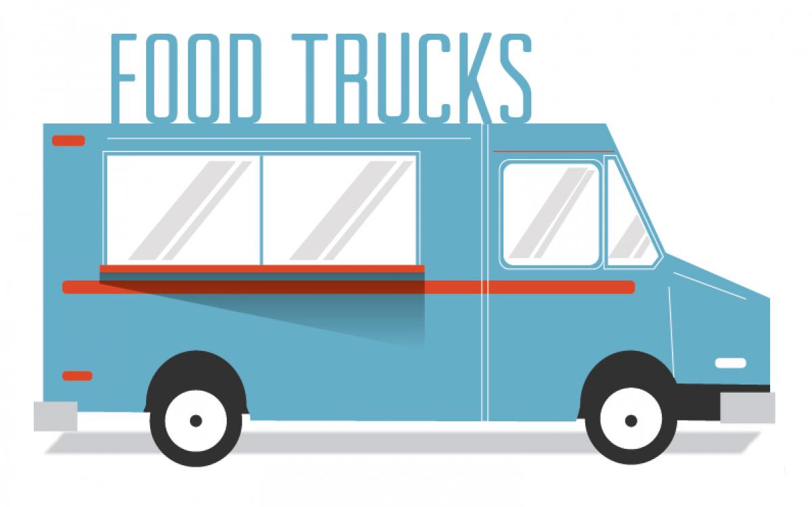

Recently at dinner, my 8 y.o. daughter asked one of the hardest questions I've ever had to answer - "Daddy, What is Kubernetes."
##### Dinnertime
Now, before you start sending my daughter LinkedIn requests and job offers, the question was prompted by our normal dinnertime conversation and as I was describing my day the keyword, **Kubernetes**, was mentioned. I was proud that she was engaged, and genuinely curious but I quickly realized the difficulty in this seemingly simple question. I will get to Kubernetes in a bit but for now, just trust me, Kubernetes is one of the hottest technologies in the industry at the moment and you should read on to learn more.

##### Why is Kubernetes hard to explain?
I have always promoted the principle that it is easy to solve a complex problem with a complex solution but very hard to solve a complex problem simply. Simplicity is hard because it requires a deep understanding of core concepts. The ability to express complex ideas in a narrative that broad audiences can understand is equally important. But sometimes really hard, especially when discussing complex technology.

So, why is Kubernetes hard to explain?
 The primary reason, I think, is related to *a posteriori* knowledge. 

To explain Kubernetes, effectively, requires explaining a lot foundational technology concepts. And, perhaps more importantly, to explain the problems these technologies are/were solving. For those of us who have been in the industry for awhile, we understand Kubernetes because of experience with many foundational technologies - both the successes and many more *failures*. 

##### What is Kubernetes?
But back to my 8 y.o. daughter and her important question. 

My first thought was to answer her question directly - "Kubernetes is a **container orchestration platform** that simplifies the ability for people to manage containers at scale." But, of course, that would not have gone over well with an 8 y.o. or probably most people.

##### The Food Truck
So, I did what all dads do when questions gets complex - I came up with an analogy.

The great thing about food trucks is that they are essentially small, specialized restaurants on wheels that are fairly inexpensive to operate. They usually offer fast service due to their limited menu - purpose-built to make a limited number of menu items and do them really well. Being mobile, they can also move to wherever hungry people are located. But, during the lunch rush even a food truck can get backed up with a line as each person in line has to wait for each previous order to be filled before they can get their food.

For example, if the line is 10 people and it takes 1 minute to prepare the order - the person in the back of the line waits 10 minutes. If the line grows to 100, thats 1 hour and 40 minute wait. Very few people would wait in *that* line resulting in lost business due the limited capacity of a single food truck. 

###### Solution(s)

This is a good problem to have - clearly the proprietor is going to be very happy more customers than capacity but how can they serve more customers (and make more money)?

__Optimize__. The first step would be to optimize operations - increasing the number of people prepping, cooking, taking orders and assembling the food or increasing the capacity of the equipment. However, at some point, the food truck is likely to be as efficient as possible and will have a limit to the number of customers it can serve per minute/hour/day.

__Build Up__. Building a freestanding restaurant would certainly increase the capacity for cooking and handling customer orders resulting in more customers served. However, building a restaurant is quite a bit more complex and costly to operate and they are *not* portable. 

__More Food Truck__. Another option is to simply duplicate the existing success by adding additional food trucks! Customers love the product and the service experience so let's give them more of what they want. Assuming fixed cost for an additional food truck and labor, it should be a pretty simple expansion of capacity to serve more customers per minute/hour/day.

__More, More Food Truck__. So now we have started to build a Food Truck empire. With all the success of the original and increase in demand the answer is - let's create a company to develop and manage more food trucks! At a certain increase in scale, we start to encounter some challenges. What do you do with excess food trucks when demand slows? How do you ensure that you are locating the food trucks in the right locations where hungry people exist? With one food truck, it was obvious. But with dozens, hundreds, or thousands - these are really significant problems that only present themselves at scale. The sole purpose of the company is to optimize revenue by making sure the right food trucks are in the right location at the right time to support demand but also to eliminate excess capacity.

##### Let's get back to Kubernetes
In our analogy, the "inside" of the food truck is the **application** - a specialized service that produces quality food as quickly as possible. The food truck itself is the **container** that allows the application to be mobile and standardized so that it can be easily duplicated. As capacity demands increase, we can add more food trucks but recognize that we need a company to manage and orchestrate the operations of all the food trucks - and that is the role of **Kubernetes**.

When demand exceeds capacity, **Kubernetes** can copy the container and its application (food truck and the service it provides) to support the demand and route traffic (customers) to available food trucks.  As demand dips, **Kubernetes** can destroy the application to save resources. This is essentially what container orchestration is all about. There are many more details, but at its core what makes **Kubernetes** both popular and useful - it takes care of many of the technical and financial challenges that dynamic capacity creates in building and managing applications.

In computation, systems performance is bound by three factors:

- Compute
- Memory
- Input/Output (I/O)

To increase system performance, you must pay attention to each factor. Increasing compute can increase processing speed; additional memory allows more objects to be manipulated at one time; and faster ability to interact with the outside world or write data to disk increases the pipeline of information to be processed. 

In modern computing, these factors are relatively inexpensive - particularly in the public cloud. However, at certain limits, these factors - compute, memory, and I/O - become prohibitively expensive. And, similar to our food truck versus restaurant analogy - it is cheaper to expand horizontally using cheap commodity hardware versus bigger more expensive computation resources. In order to build massively large scale systems (e.g. Gmail, Lyft, etc.), in a cost effective manner it is better to scale horizontally (more food trucks OR copies of the applications) than vertically (building a restauarant OR buying bigger CPUs, memory chips or faster read/write capacity). 

Our physical world analogy can only take us so far and starts to break down in comparison to the digital world when we look closer. In the physical world, duplicating a food truck is expensive and time consuming. But in the digital world, creating a new application can be nearly instantaneous and relatively cheap. Destroying a food truck in the real world is permenant and wasteful of resources but in the digital world going from 10 copies of an application to 1 simply frees previously unavailable resources that are fully recoverable for reuse.

There are also many details I have glossed over - namely how are systems designed to scale horizontally architected and what tools and technologies make it possible to create and destroy compute resources on demand. **Kubernetes** provides a lot of the heavy lifting here but there are many more components and processes that are important to consider - such as DevOps and continuous integration and delivery. I will elaborate on these topics in future articles.

##### Did that help? 
Hopefully this article provides a simple analogy that serves as a useful framework for understanding the complexity of Kubernetes. I know for me at least, it made it a little easier to explain Kubernetes to my family at dinner.