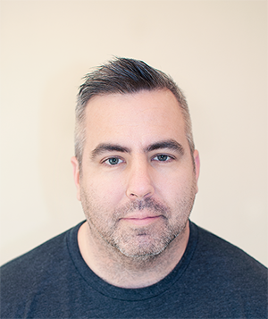

Hello, my name is Jonathan (Jon) Smith. I live in the San Francisco Bay Area and work in the technology industry. I work at VMware in the Cloud Native Applications group having joined through the acquisition of [Heptio](https://www.heptio.com/ "Heptio's Homepage") in 2018.

This is my personal blog and all opinions are my own. In this blog I will strive to capture my thoughts and experiences on a variety of personal and professional topics including - Technology, Music, Sports, Travel, and San Francisco (my adopted city).
